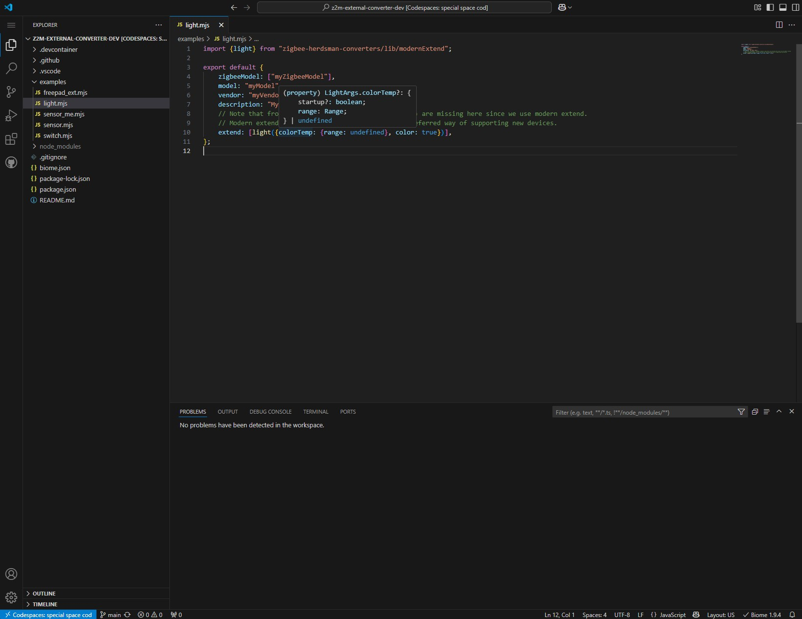

# Zigbee2MQTT external converter development

Template to create external converters for Zigbee2MQTT in codespace.

The environment is setup to automatically detect the API of [zigbee-herdsman-converters](https://github.com/Koenkk/zigbee-herdsman-converters) (and [zigbee-herdsman](https://github.com/Koenkk/zigbee-herdsman)).

The editor will:
- make suggestions (with auto-completion)
- offer insights on hover
- follow definition with <kbd>Ctrl</kbd> + <kbd>click</kbd> (view typing)
- highlight problems & suggest fixes
- ...and more: https://code.visualstudio.com/Docs/languages/javascript

# How to use

With your Github account, go to https://github.com/Nerivec/z2m-external-converter-dev and select in the top right corner: `Use this template` > `Open in a codespace`.

You can start by copying one of the examples and modifying it to fit the targeted device.
More details: https://www.zigbee2mqtt.io/advanced/more/external_converters.html

# Codespace

https://docs.github.com/en/codespaces/quickstart

The codespace uses [biomejs](https://biomejs.dev/) for linting and formatting, with the [same configuration as zigbee-herdsman-converters](https://github.com/Koenkk/zigbee-herdsman-converters/blob/master/biome.json). A task is available to check the code: `Terminal` > `Run task` > `npm: check`. The default settings of the codespace will also automatically format on paste and on save.

> [!TIP]
> If a new version of [zigbee-herdsman-converters](https://github.com/Koenkk/zigbee-herdsman-converters) is available but your codespace does not yet have it you can run the task: `Terminal` > `Run task` > `npm: update-zhc`. This command also runs on start of the codespace.

# Snippets

https://code.visualstudio.com/docs/editing/userdefinedsnippets

A few snippets specific to [zigbee-herdsman-converters](https://github.com/Koenkk/zigbee-herdsman-converters) are available:

- `fz` or `from` => Create a 'fromZigbee' converter variable with typing
- `tz` or `to` => Create a 'toZigbee' converter variable with typing
- `mdef` or `modern` => Create an exported modern definition with typing
- `def` => Create an exported definition with typing
